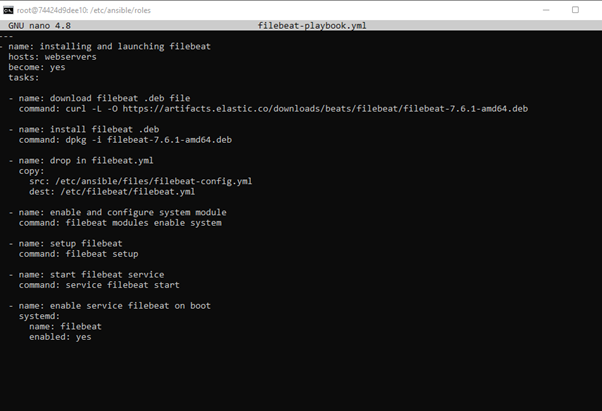

# Bootcamp
Bootcamp Homework_BlancheReed
## Automated ELK Stack Deployment

The files in this repository were used to configure the network depicted below.

 

These files have been tested and used to generate a live ELK deployment on Azure. They can be used to either recreate the entire deployment pictured above. Alternatively, select portions of the yml file may be used to install only certain pieces of it, such as Filebeat.

 

This document contains the following details:
- Description of the Topology
- Access Policies
- ELK Configuration
  - Beats in Use
  - Machines Being Monitored
- How to Use the Ansible Build

### Description of the Topology

The main purpose of this network is to expose a load-balanced and monitored instance of DVWA, the D*mn Vulnerable Web Application.

Load balancing ensures that the application will be highly available, in addition to restricting access to the network.
- What aspect of security do load balancers protect? Load balancer defends an organization against distributed denial-of-service (DDoS) attacks.
- What is the advantage of a jump box? This will secure the Jump Box from attacks such as DDoS.

Integrating an ELK server allows users to easily monitor the vulnerable VMs for changes to the logs and system traffic.
- What does Filebeat watch for? Filebeat monitors the log files or locations that you specify, collects log events, and forwards them either to Elasticsearch or Logstash for indexing.
- What does Metricbeat record? Metricbeat is a lightweight shipper that you can install on your servers to periodically collect metrics from the operating system and from services running on the server. Metricbeat takes the metrics and statistics that it collects and ships them to the output that you specify, such as Elasticsearch or Logstash.

The configuration details of each machine may be found below.
_Note: Use the [Markdown Table Generator](http://www.tablesgenerator.com/markdown_tables) to add/remove values from the table_.

| Name    | Function   | Ip Address    | OS     |
|---------|------------|---------------|--------|
| Jumpbox | Gateway    | 10.0.0.4      | Ubuntu |
| Web 1   | DVWA       | 10.0.0.5      | Ubuntu |
| Web 2   | DVWA       | 10.0.0.6      | Ubuntu |
| Elk     | Monitoring | 40.115.78.130 | Ubuntu |

### Access Policies

The machines on the internal network are not exposed to the public Internet. 

Only the Jumpbox machine can accept connections from the Internet. Access to this machine is only allowed from the following IP addresses:
- 172.192.3.201

Machines within the network can only be accessed by the ansible container.
- 172.192.15.109

A summary of the access policies in place can be found in the table below.

| Name    | Publicly Accessible | Allowed Ip Addresses |
|---------|---------------------|----------------------|
| Jumpbox | Yes                 | 172.187.202.212      |
| Web 1   | No                  | 10.0.0.4             |
| Web 2   | No                  | 10.0.0.4             |
| Elk     | No                  | 172.192.15.109       |

### Elk Configuration

Ansible was used to automate configuration of the ELK machine. No configuration was performed manually, which is advantageous because this icreasing accuracy.

The playbook implements the following tasks:
- In 3-5 bullets, explain the steps of the ELK installation play. E.g., install Docker; download image; etc: 
- Install Docker.io 
- Install Python script 
- Install Python Docker Module 
- Download and launch docker web container

The following screenshot displays the result of running `docker ps` after successfully configuring the ELK instance.

### Target Machines & Beats
This ELK server is configured to monitor the following machines:
- 10.0.0.5 : Web1
- 10.0.0.6 : Web2

We have installed the following Beats on these machines:
- Filebeat, Metricbeat

These Beats allow us to collect the following information from each machine:
- Filebeat is utlized for collecting all log streams, as well as fetching metadata such as containers, pods, nodes, virtual environments, and hosts and automatically correlates them to corresponding log events.
- Metricbeat helps you monitor your servers by collecting metrics from the system and services running on the server. Metricbeat can insert the collected metrics directly into Elasticsearch or send them to Logstash

### Using the Playbook
In order to use the playbook, you will need to have an Ansible control node already configured. Assuming you have such a control node provisioned: 

SSH into the control node and follow the steps below:
- Copy the yml file to /etc/ansible/ 
- Update the hostsfile to include IP address of the machine that you intend to add.
- Run the playbook, and navigate to curl localhost/setup.php to check that the installation worked as expected.
